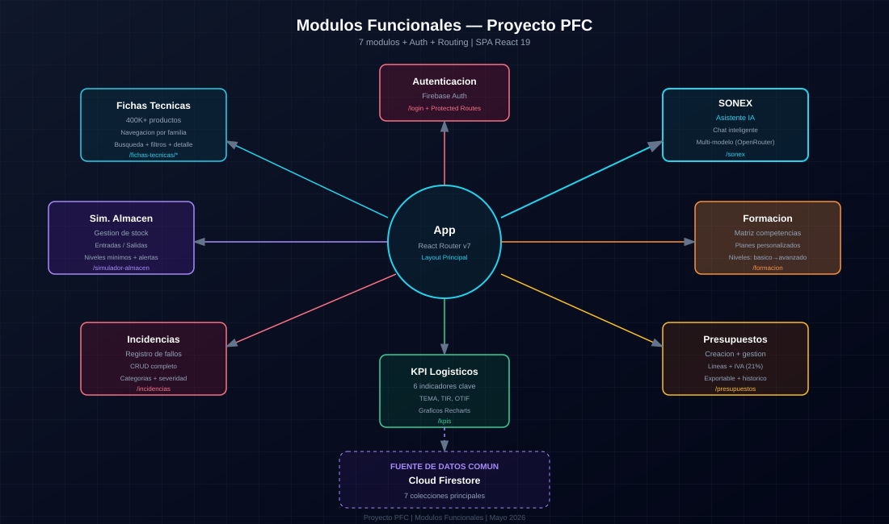
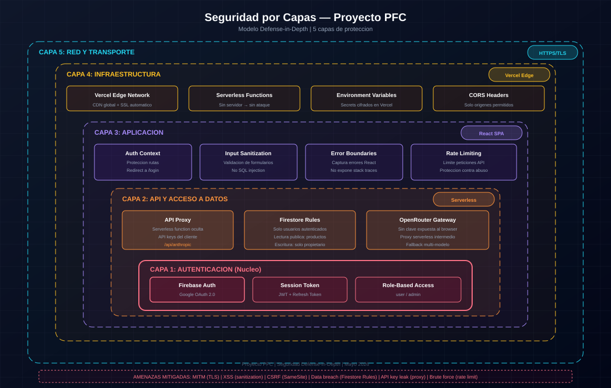

# Arquitectura del Sistema

## Visión general

**Proyecto PFC** es una **Single Page Application (SPA)** construida con React 19, desplegada en Vercel, con autenticación y base de datos en Supabase (PostgreSQL), e integrada con OpenRouter para funcionalidades de IA.

---

## Diagramas del sistema

En vez de esquemas eléctricos (que no tocan aquí), el proyecto tiene diagramas visuales que explican cómo está montado todo. Están hechos con Excalidraw y guardados como SVG en la carpeta `docs/diagrams/`.

### Diagramas del sistema

| Archivo | Muestra |
|---------|---------|
| `modulos_funcionales.svg` | Los 7 módulos y cómo se relacionan entre sí |
| `seguridad_capas.svg` | Las 5 capas de seguridad (defense-in-depth) |





---

## Componentes principales

### Capa de presentación (Frontend)

| Componente | Tecnología | Función |
|------------|------------|---------|
| **App.jsx** | React Router v7 | Routing, rutas protegidas |
| **AppShell** | Layout | Estructura común (Topbar, Sidebar) |
| **ThemeContext** | React Context | Modo claro/oscuro |
| **AuthContext** | React Context | Estado de autenticación |
| **ToastContext** | React Context | Notificaciones |

### Módulos de aplicación

| Módulo | Componente | Descripción |
|--------|------------|-------------|
| **Fichas Técnicas** | `TarjetaFicha` | Catálogo de productos |
| **Almacén** | `SimuladorAlmacen` | Flujo de pedido |
| **Incidencias** | `DashboardIncidencias` | Registro y seguimiento |
| **KPI** | `KpiDashboard` | Indicadores visuales |
| **Presupuestos** | `GeneradorPresupuestos` | Creación de presupuestos |
| **Formación** | `GestionFormacion` | Matriz de competencias |
| **SONEX** | `ChatSonex` | Asistente IA |

### Capa de datos

| Servicio | Tecnología | Función |
|----------|------------|---------|
| **catalogService** | Supabase (PostgreSQL) | Catálogo de productos (products + brands) |
| **AuthContext** | Supabase Auth | Autenticación Google OAuth |
| **anthropicService** | OpenRouter API | Gateway IA unificado |
| **api/ai.js** | Vercel Function | Serverless proxy IA con rate limiting |

---

## Flujo de datos

### Flujo 1: Carga de catálogo

```
1. Usuario entra en Fichas Técnicas
2. Hook useFichasTecnicas se monta
3. catalogService.getHierarchy() → jerarquía familias/marcas/gamas
4. catalogService.getProductosPorFiltro() → productos filtrados
5. Componente renderiza con datos
```

### Flujo 2: Chat con SONEX

```
1. Usuario envía mensaje
2. handleSendMessage() llama a aiService
3. aiService.sendMessage() → Vercel Function /api/ai
4. Vercel Function → OpenRouter API (Claude/GPT)
5. Respuesta.stream() → UI con streaming
6. useEffect detecta referencias → añade botones "Ver ficha"
```

### Flujo 3: Autenticación

```
1. Usuario entra en app
2. ProtectedRoute verifica AuthContext
3. Si no auth → redirect a /login
4. LoginPage → Firebase Google OAuth
5. onAuthStateChanged → AuthContext actualizado
6. Redirect a HomePage
```

---

## Capas de seguridad

### Capa 1: Autenticación
- Supabase Auth (Google OAuth)
- ProtectedRoute en todas las rutas `/app/*`
- Sesión persistente con `onAuthStateChange`

### Capa 2: Autorización
- Row Level Security (RLS) en Supabase
- Datos por usuario autenticado

### Capa 3: Red
- HTTPS obligatorio (Vercel)
- CSP headers (Content-Security-Policy)
- X-Content-Type-Options, X-Frame-Options, X-XSS-Protection

### Capa 4: API Gateway
- CORS whitelist (solo orígenes permitidos)
- Rate limiting (30 req/min por IP)
- Model validation (whitelist de modelos)
- Input bounds (max 50 msgs, 50k chars)

### Capa 5: Datos
- Sanitización de inputs (`.or()` filters, search queries)
- DOMPurify en rendering de markdown
- textContent en mensajes de error (no innerHTML)

---

## Servicios externos

| Servicio | Uso | Tier |
|----------|-----|------|
| **Supabase** | PostgreSQL + Auth | Free (gratis) |
| **Vercel** | Hosting + Functions | Hobby (gratis) |
| **OpenRouter** | API de IA | Free (gratis) |
| **GitHub** | Control de versiones | Free (gratis) |

---

## Consideraciones de escalabilidad

### Problema: 400K+ productos

**Solución implementada:**
- Paginación en Firestore (`.limit(50)` + cursor)
- Búsqueda por keywords precalculadas
- Navegación jerárquica (no listado plano)

### Problema: Rate limits

**Solución:**
- OpenRouter tiene límites diarios
- MessageQueue para evitar flooding
- UI muestra estado de "escribiendo..."

### Problema: Coste

**Solución:**
- Solo tier gratuito
- Alertas de uso (pendiente)
- Migración a Supabase en curso

---

*Arquitectura documentada: Mayo 2026*
*Ver también:*
- `listado-componentes.md` — Inventario completo de rutas, componentes, hooks y APIs
- `EVOLUCION.md` — Cronología de decisiones técnicas
- `docs/diagrams/` — Esquemas visuales del sistema*
