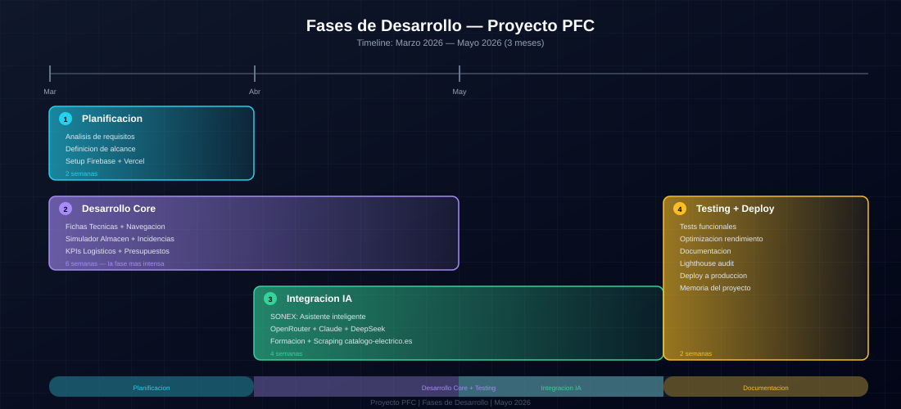
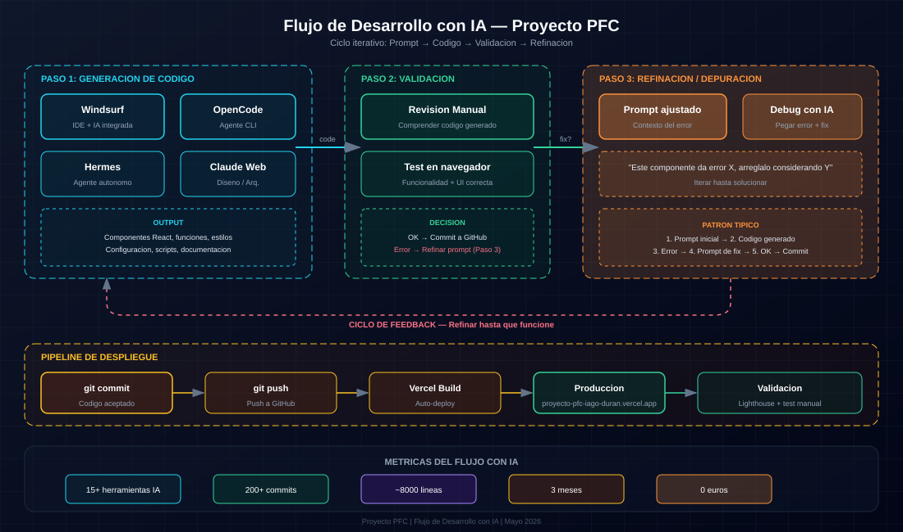

# Fases de Desarrollo — Cómo fue evolucionando

## Visión general

El proyecto pasó por 12 fases en 3 meses. Algunas duraron un día, otras una semana. Esto es lo que pasó en cada una, ordenado tal y como ocurrió.

---

## Fase 0 — Artefactos individuales (7 mar 2026)

**Estado:** 7 herramientas como archivos `.jsx` independientes

### Qué se creó

Cada herramienta era un archivo autocontenido:

- `Proyecto PFC-almacen-simulador.jsx` — Simulador de flujo de almacén
- `Proyecto PFC-fichas-tecnicas.jsx` — Fichas técnicas de productos
- `Proyecto PFC-dashboard-incidencias.jsx` — Dashboard de incidencias industriales
- `Proyecto PFC-kpi-logistico.jsx` — KPI logístico con semáforo
- `Proyecto PFC-generador-presupuestos.jsx` — Generador de presupuestos
- `Proyecto PFC-formacion-interna.jsx` — Matriz de competencias y formación
- `Proyecto PFC-chatbot-tecnico.jsx` — SONEX, chatbot técnico

### Tecnología usada

- React puro (JSX)
- CSS-in-JS inline
- API de Anthropic (Claude) directamente desde frontend
- `localStorage` para persistencia

### Herramienta IA

**Claude Web** — Generó los 7 artefactos completos.

### Qué se resolvió

- Primera versión funcional de cada herramienta
- Validación de que los conceptos funcionaban

### Problemas encontrados

- No había forma de navegar entre herramientas
- No había persistencia real (solo localStorage)
- La API key estaba expuesta en el código

---

## Fase 1 — Proyecto Vite + Rediseño profesional (7-15 mar 2026)

**Objetivo:** Convertir los 7 artefactos sueltos en una SPA unificada

### Pasos realizados

| Paso | Descripción |
|------|-------------|
| F1.1 | Crear proyecto Vite con React 19, instalar dependencias, tipografía IBM Plex Sans |
| F1.2 | Layout AppShell con Topbar y Sidebar |
| F1.3 | Router (React Router DOM v7) con 7 rutas, configuración de `vercel.json` |
| F1.4 | Reset CSS global, fuentes |
| F1.5 | Sidebar dinámico con información contextual por herramienta |

### Tecnología añadida

- Vite 7
- React Router DOM v7
- CSS Modules (reemplazando CSS-in-JS inline)
- lucide-react para iconos

### Herramienta IA

**Claude Web + Windsurf** — Windsurf empezó a usarse para la fase de integración.

### Problema resuelto

La API key de Anthropic estaba hardcodeada en el frontend. Se creó un proxy serverless en Vercel (`api/anthropic.js`) para ocultar la clave.

---

## Fase 2 — Componentes UI + Migración de herramientas (15-16 mar 2026)

**Objetivo:** Crear un sistema de componentes UI reutilizable y migrar las 7 herramientas

### Qué se hizo

- Componentes base: `Button`, `Badge`, `Input`, `Card`, `StreamIndicator`, `Toast`
- Extracción de hooks personalizados (`useFichasTecnicas`, etc.)
- Componentes especializados (`TarjetaFicha`)
- Estandarización visual con tema azul/blanco corporativo la empresa
- Sidebar con iconos lucide-react

### Herramienta IA

**Windsurf** — Coding diario para migrar y crear componentes.

---

## Fase 3 — SONEX evolución v3→v7 (8-11 mar 2026)

**Objetivo:** Mejorar el chatbot técnico

### Versiones

| Versión | Características |
|---------|-----------------|
| **v3** | Especialización la empresa, 5 modos de consulta, system prompt completo |
| **v4** | Analytics, exportar consultas, detección de familias de producto |
| **v5** | Fix pantalla blanca (error en orden de declaraciones) |
| **v6** | Diseño corporativo la empresa, catálogo ampliado a 80 productos |
| **v7** | Streaming de respuestas, detección automática de modo, verificador de referencias, exportar PDF |

### Herramienta IA

**Claude Web** — Diseño del system prompt, arquitectura de respuestas.

---

## Fase 4 — Flujos inter-herramientas + Catálogo (21-22 mar 2026)

**Objetivo:** Conectar las herramientas entre sí

### Logros

- Catálogo unificado de 65 referencias reales de la empresa
- SONEX detecta referencias en sus respuestas y ofrece botón "Ver ficha"
- Desde fichas se puede ir a presupuestos con `ADD_ITEM` (URL param)
- Procesamiento de Markdown en respuestas de SONEX

### Versión 2.0.0 etiquetada

**Importante:** Esta fue la primera versión "release" del proyecto.

---

## Fase 5 — Modo oscuro + WelcomeState (22 mar 2026)

**Objetivo:** Mejorar UX

### Qué se añadió

- Toggle de modo oscuro (ThemeContext)
- WelcomeState para cada herramienta (pantalla de bienvenida antes de usar)
- SegmentedControl como componente UI

### Tecnología

- ThemeContext con CSS variables
- View Transitions API para transiciones animadas

---

## Fase 6 — Autenticación + Responsive (7 abr 2026)

**Versión 3.0.0**

### Qué se añadió

- **Firebase Auth** con Google Sign-In
- **Rutas protegidas** (ProtectedRoute) — toda la app requiere login
- **Menú hamburguesa responsive** (tablet + mobile)
- **Avatar** con iniciales cuando no hay foto de Google
- **Accesibilidad** ARIA en menú hamburguesa
- **Suite E2E** con Playwright — 14 tests

### Problema

Los tests E2E funcionaban pero se perdieron en commits posteriores.

---

## Fase 7 — Migración a Firestore (7-8 abr 2026)

**Objetivo:** Pasar de datos locales a Firestore

### Qué se añadió

- Integración con Firestore
- Hooks de sincronización (`useFirestoreSync`)
- Security rules por colección
- Navegación jerárquica en Fichas Técnicas
- Logos de marcas locales

### Problemas con Firestore

- Límite de 50K escrituras/día en plan Spark
- SDK a veces se quedaba colgado
- Dificultad para buscar por nombre

---

## Fase 8 — Sistema de diseño circular + Catálogo masivo (8-10 abr 2026)

**Objetivo:** Escalar el catálogo

### Qué se añadió

- **Diseño circular** completo aplicado a todas las herramientas
- Catálogo expandido: 120 → 2.864 → **75.000 productos**
- View Transitions API para transición animado del tema

### Scrapers desarrollados

- v11 — Usaba 1,169 combinaciones Familia+Marca
- v12 — "THE ULTIMATE HARVESTER" con interceptación de peticiones HTTP

---

## Fase 9 — Landing Page Hero (11-12 abr 2026)

**Objetivo:** Mejorar la primera impresión

### Qué se añadió (3 fases)

1. **Fase 1** — Mockup clickeable con screenshots de las 7 herramientas, background animado
2. **Fase 2** — CTA, Roadmap con versiones reales, Tech Stack, stats dinámicos
3. **Fase 3** — SEO, meta tags, optimización

---

## Fase 10 — Migración a Supabase (mayo 2026, en curso)

**Objetivo:** Sustituir Firestore por PostgreSQL

### Qué se está haciendo

- Scripts de sincronización a Supabase
- Migración de estructura de datos
- Cambios en catalogService

### Estado

En progreso. Ver `app/supabase/` y scripts en `app/scripts/`.

---

## Resumen cronológico

| Fase | Fechas | Hito principal |
|------|--------|----------------|
| 0 | 7 mar | 7 artefactos JSX |
| 1 | 7-15 mar | SPA con Vite |
| 2 | 15-16 mar | Componentes UI |
| 3 | 8-11 mar | SONEX v3-v7 |
| 4 | 21-22 mar | v2.0.0 - Flujos |
| 5 | 22 mar | Modo oscuro |
| 6 | 7 abr | v3.0.0 - Auth |
| 7 | 7-8 abr | Firestore |
| 8 | 8-10 abr | 75K productos |
| 9 | 11-12 abr | Landing page |
| 10 | mayo | Supabase (en curso) |

---

## Lecciones de la cronología

1. **Empezar simple:** Los artefactos sueltos fueron el punto de partida correcto
2. **Iterar rápido:** Cada día había una versión nueva funcional
3. **No tener miedo de refactorizar:** La migración a Vite fue un acierto
4. **Documentar mientras se hace:** EVOLUCION.md es esencial

---

*Fases de desarrollo documentadas: Mayo 2026*
*Ver también: EVOLUCION.md del repositorio principal*

---

## Flujo de trabajo con IA

El desarrollo siguió un ciclo iterativo constante: prompt → código → validación → refinación. Este diagrama muestra el patrón que se repitió en cada fase:

