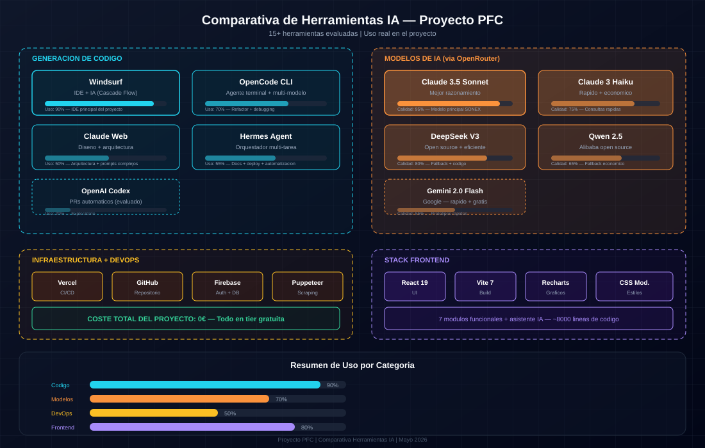

# Herramientas IA — Visión general

Este capítulo documenta las 15+ herramientas de IA evaluadas durante el desarrollo del proyecto. Cada ficha individual cubre una herramienta en detalle. Aquí tienes la comparativa visual de uso real:

## Categorías de uso

### Generación de código
- **Windsurf** — IDE principal (90% uso)
- **OpenCode CLI** — Refactor + debugging (70%)
- **Claude Web** — Arquitectura + prompts complejos (50%)
- **Hermes Agent** — Docs + deploy + automatización (55%)

### Modelos de IA (vía OpenRouter)
- **Claude 3.5 Sonnet** — Modelo principal SONEX (95%)
- **DeepSeek V3** — Fallback + código (80%)
- **Claude 3 Haiku** — Consultas rápidas (75%)
- **Qwen 2.5** — Fallback económico (65%)

### Infraestructura
- **Vercel** — CI/CD + hosting
- **GitHub** — Repositorio
- **Supabase** — Auth + DB (PostgreSQL)
- **Playwright** — Scraping + E2E

---

*Comparativa documentada: Mayo 2026*
*Ver las fichas individuales en este directorio para detalles de cada herramienta*
