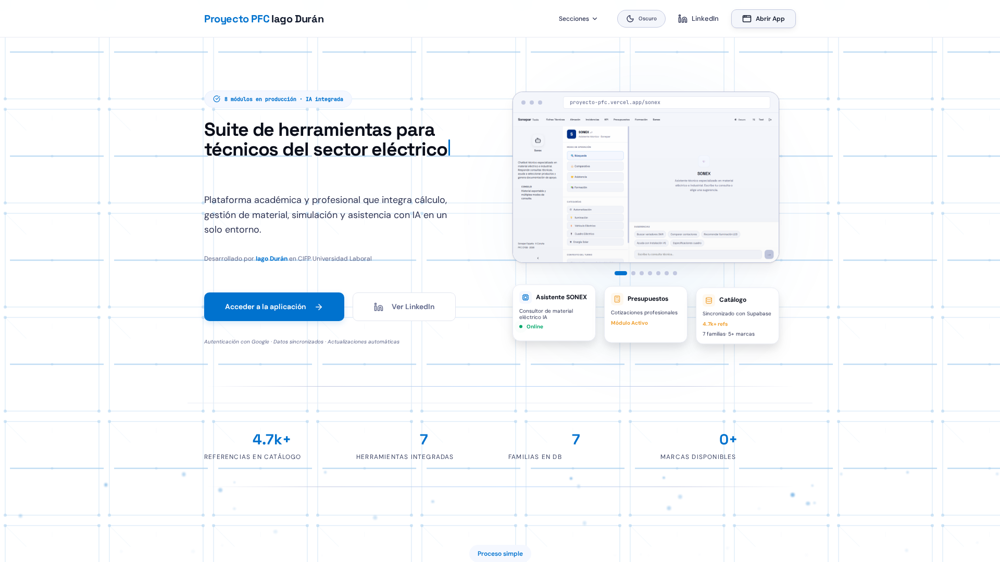
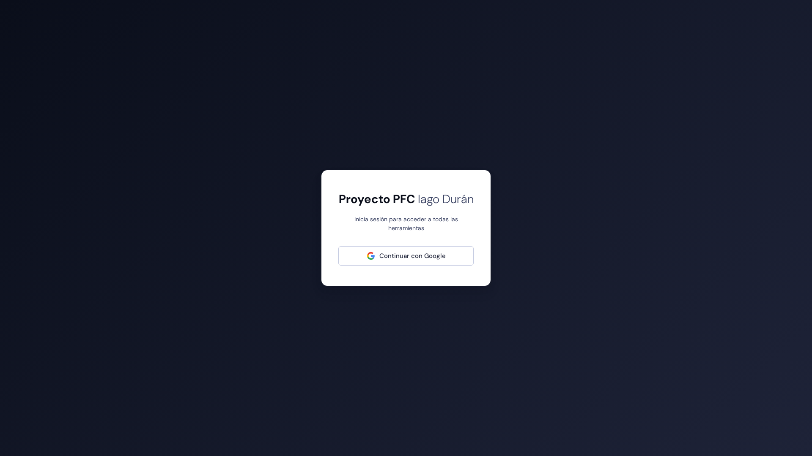

# Capturas de Pantalla

A continuación se muestran las capturas de pantalla de la interfaz de la aplicación, que reflejan los diferentes módulos y la navegación en producción.

---

## Acceso y Dashboard Principal

### Landing Page (Pública)

Página de acceso público sin autenticación. Muestra una vista general de los 8 módulos disponibles y presenta el proyecto de cara al usuario.

### Autenticación (Login)

Pantalla de acceso seguro que integra el sistema de autenticación a través de Google OAuth mediante Supabase.

### Dashboard Global

Panel de control principal unificado desde el que los usuarios autenticados pueden visualizar el estado del sistema y saltar a los diferentes módulos.

---

## Módulos de Catálogo y Asistencia

### Fichas Técnicas

Navegación jerárquica por el catálogo de productos (Familias → Marcas → Gamas).

### Detalle de Producto

Visualización detallada de la información técnica y descripción ampliada de un producto específico, enriquecida en tiempo real con IA.

### SONEX - Asistente Técnico

Chat interactivo y asistente inteligente especializado en el sector eléctrico, que responde consultas técnicas e identifica productos.

---

## Módulos Operativos y Analíticos

### Simulador de Almacén

Simulador gamificado de 4 etapas que recrea el ciclo logístico y de pedidos de la empresa.

### Dashboard de Incidencias

Registro de averías e incidencias operativas, con diagnóstico automatizado asistido por modelos de lenguaje.

### KPIs Logísticos

Cálculo dinámico de indicadores clave de rendimiento (KPIs) con visualizaciones gráficas interactivas.

---

## Módulos de Gestión

### Generador de Presupuestos

Asistente de cotización integrado con el catálogo de productos para la creación y exportación de presupuestos en PDF.

### Matriz de Formación

Matriz interactiva para el seguimiento de la formación, competencias y módulos completados por el personal técnico.

