# Evidencia visual de la aplicación

Las capturas de este capítulo enlazan a imágenes que **existen en el repositorio** bajo `app/e2e/screenshots/`. Sustituyen las antiguas referencias a `assets/extracted_v7/`, que no existían en el snapshot auditado.

## Acceso y navegación

### Login

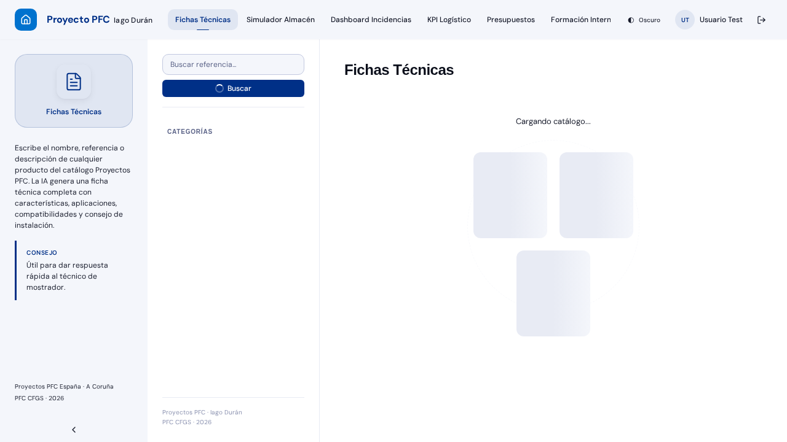

### Navegación y shell

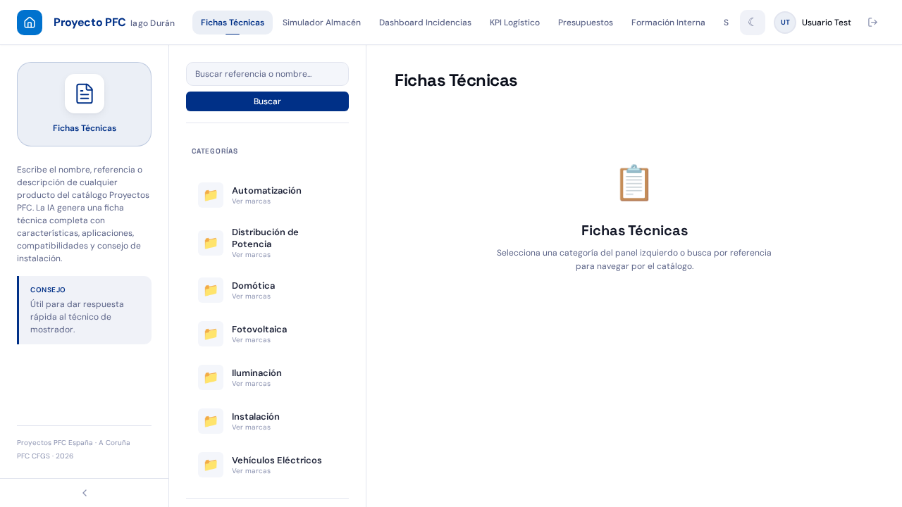

## Herramientas

### Fichas Técnicas

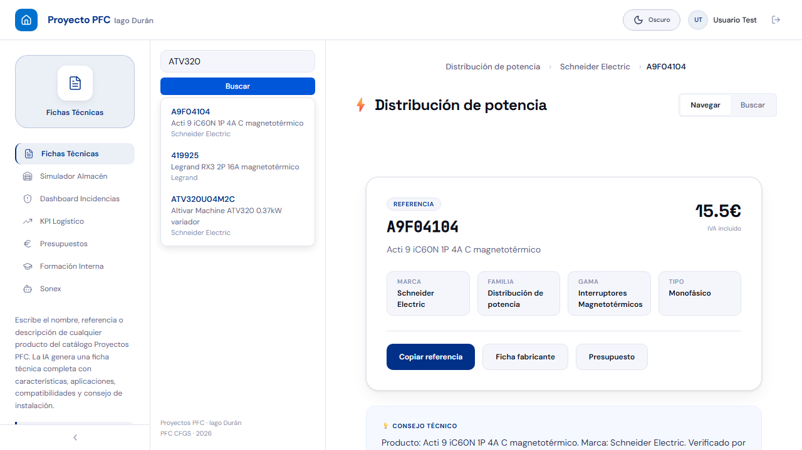

### Simulador de Almacén

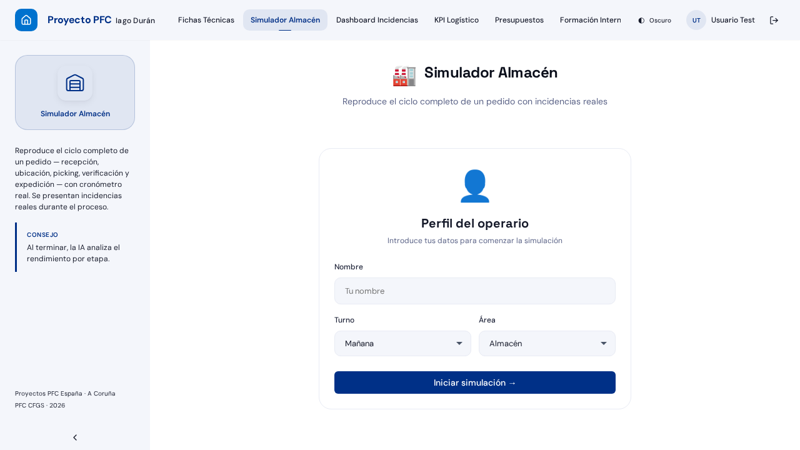

### Incidencias

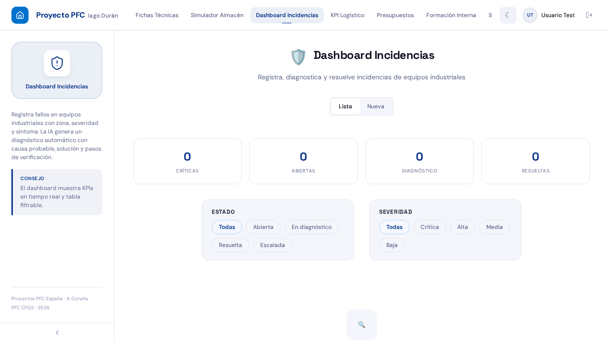

### KPI Logístico

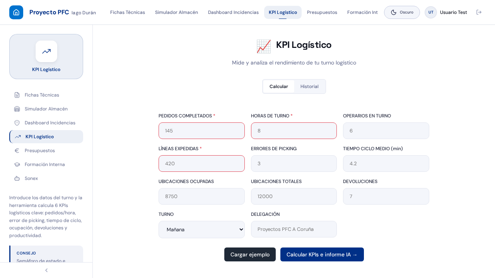

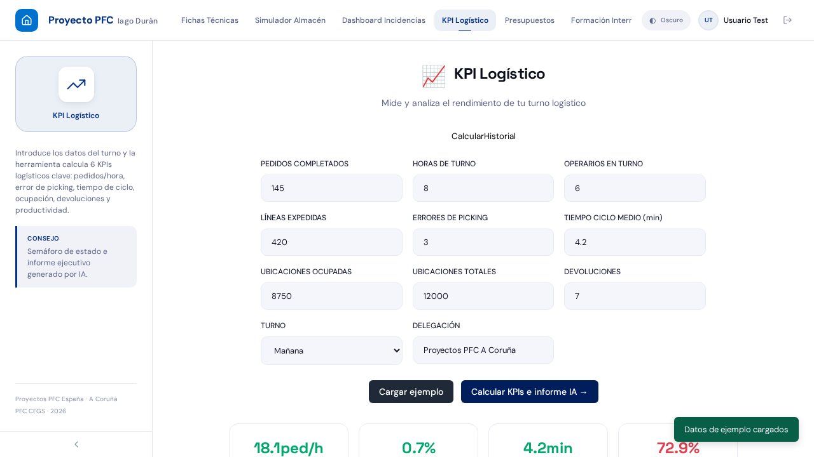

### Presupuestos

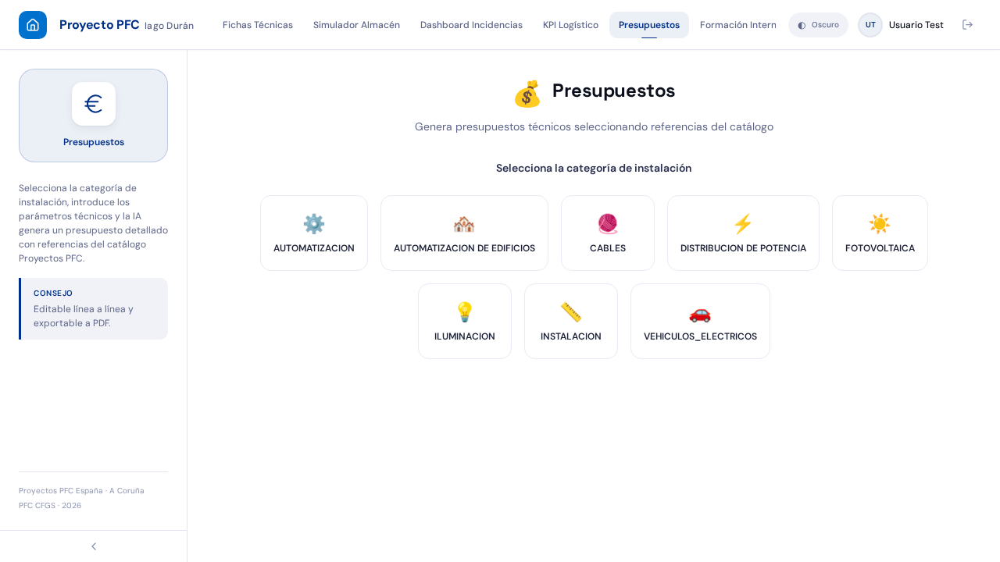

### Formación

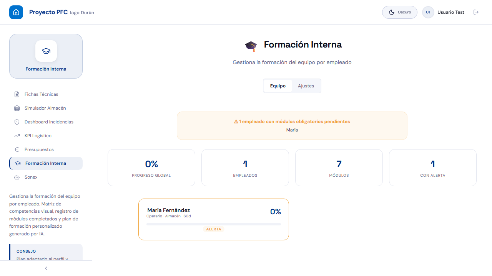

### SONEX

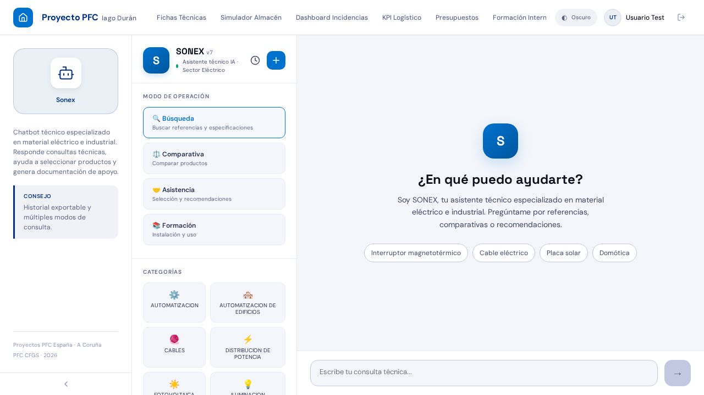

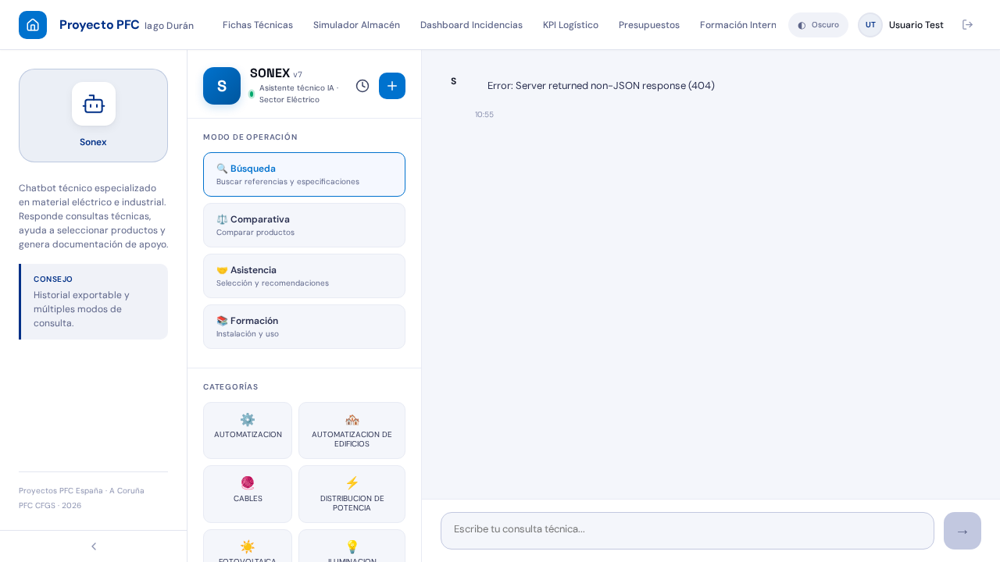

## Responsive y tema

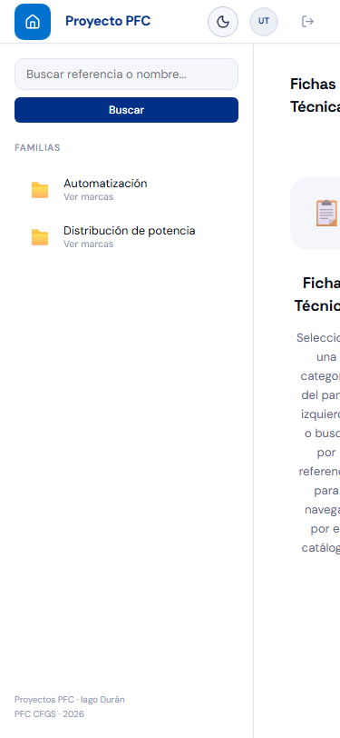

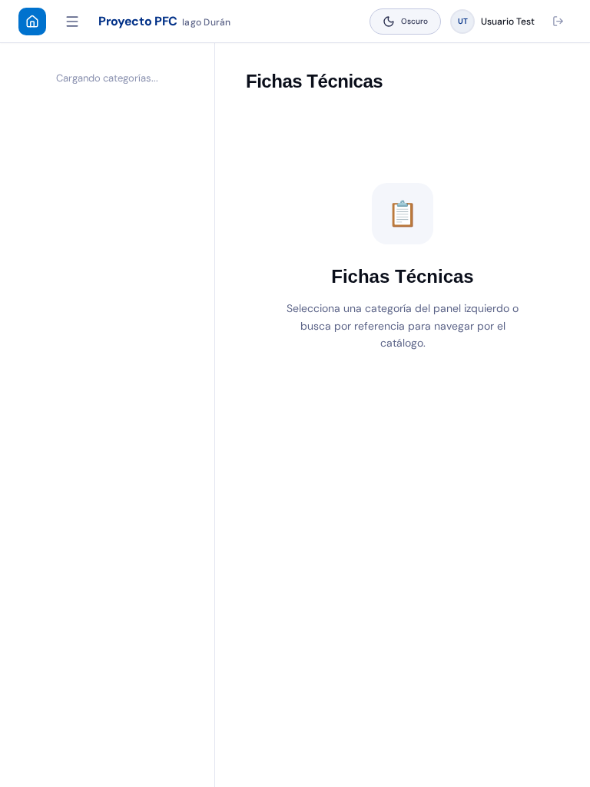

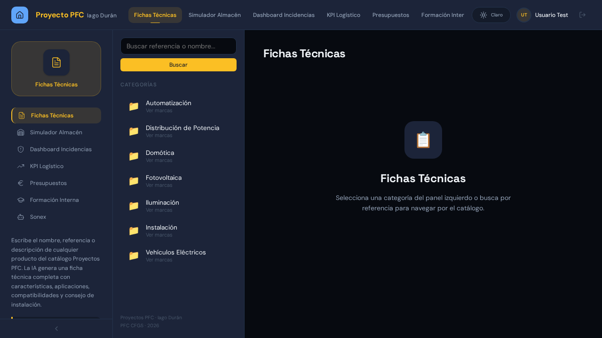

## Landing

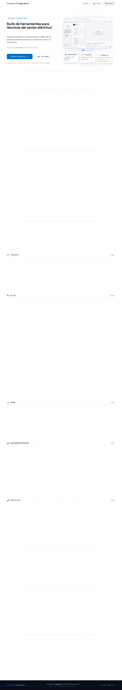

> Estas imágenes son evidencia versionada del repositorio. No implican por sí solas que todos los flujos estén pasando actualmente; para eso hace falta una ejecución fresca de las pruebas.

*Evidencia visual reconciliada — agosto de 2026.*
