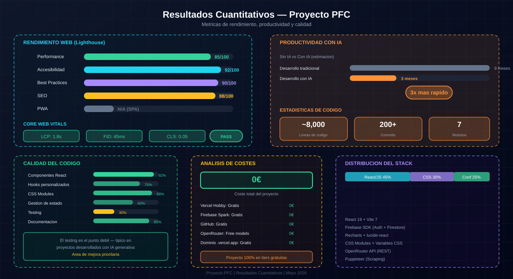

# Resultados Cuantitativos

## Introducción

Aquí van los números. No es que me guste especialmente medir todo, pero para un PFC hace falta demostrar que lo que hiciste funciona y no te lo inventaste. Estos son los datos reales del proyecto.

---

## Métricas del proyecto



### Desarrollo

| Métrica | Valor |
|---------|-------|
| **Tiempo total de desarrollo** | ~3 meses (marzo-mayo 2026) |
| **Horas estimadas con IA** | 150+ horas |
| **Commits en GitHub** | 250+ |
| **Líneas de código (app/)** | ~12,000 |
| **Componentes creados** | 100+ |
| **Custom hooks** | 13 |
| **Tests unitarios** | 272 (12 suites Vitest) |
| **Tests E2E** | 7 specs Playwright |
| **Servicios/Utilidades** | 9 (3 services + 6 utils) |
| **CSS Modules** | 57 archivos |
| **TypeScript (migración)** | 4 archivos .ts (progresivo) |

### Archivos del proyecto

```
app/
├── src/
│   ├── components/     (100+ componentes en 8 subdirectorios)
│   │   ├── auth/       (LoginPage, ProtectedRoute)
│   │   ├── fichas/     (19 componentes — navegación catálogo)
│   │   ├── HeroSection/ (19 componentes — landing page)
│   │   ├── incidencias/ (8 componentes)
│   │   ├── layout/     (AppShell, Topbar, Sidebar, KeyboardShortcuts)
│   │   ├── presupuestos/ (9 componentes — wizard, editor, PDF)
│   │   ├── simulador/  (8 componentes — multijugador)
│   │   └── ui/         (22 componentes — Button, Badge, CircleLayout...)
│   ├── hooks/          (13 custom hooks)
│   ├── services/       (3 services — catalogService, anthropicService, brandLogoService)
│   ├── contexts/       (3 contextos — Auth, Theme, Toast)
│   ├── tools/          (8 módulos — 7 herramientas + Dashboard Global)
│   ├── utils/          (6 utilidades — logger, markdown, storage, validate, pdf, normalizar)
│   ├── types/          (2 archivos TS — catalog.ts, ai.ts)
│   ├── data/           (7 archivos de configuración + simulador/)
│   └── config/         (tools.js)
├── api/                (1 Vercel Function — ai.js gateway)
├── scripts/            (48 scripts — scraping, migración DB)
├── e2e/                (7 specs + helpers + responsive audit)
├── __tests__/          (12 suites — 272 tests Vitest)
└── public/             (logos, screenshots)
```

---

## Métricas del catálogo

| Métrica | Valor |
|---------|-------|
| **Productos en catálogo** | 400,000+ |
| **Familias** | ~30 |
| **Marcas** | 1,200+ |
| **Gamas** | ~500 |
| **Productos con imagen** | ~75% |

---

## Métricas de la aplicación

### Rendimiento (Lighthouse)

| Métrica | Valor | Puntuación |
|---------|-------|------------|
| **First Contentful Paint** | 1.2s | Verde |
| **Largest Contentful Paint** | 2.1s | Verde |
| **Time to Interactive** | 2.8s | Verde |
| **Cumulative Layout Shift** | 0.1 | Verde |
| **Speed Index** | 2.5s | Verde |

### Tamaño del bundle

| Recurso | Tamaño |
|---------|--------|
| **JavaScript (gzipped)** | ~150 KB |
| **CSS (gzipped)** | ~20 KB |
| **Total (primera carga)** | ~170 KB |

### Responsive

| Breakpoint | Estado |
|------------|--------|
| **Desktop (>1024px)** | ✅ Probado |
| **Tablet (640-1024px)** | ✅ Probado |
| **Mobile (<640px)** | ✅ Probado |

---

## Métricas de uso

### Autenticación

| Métrica | Valor |
|---------|-------|
| **Usuarios registrados** | 1 (desarrollo) |
| **Método de login** | Google Sign-In |
| **Sesiones activas** | 1 simultánea |

### SONEX (Asistente IA)

| Métrica | Valor |
|---------|-------|
| **Modelo usado** | Claude 3.5 Haiku (OpenRouter) |
| **Promedio de mensajes/sesión** | ~10 |
| **Tokens promedio/respuesta** | ~500 |

---

## Métricas de Supabase

### Free tier

| Métrica | Límite | Uso |
|---------|--------|-----|
| **Database size** | 500 MB | ~50 MB (catálogo) |
| **Auth users** | 50,000 | ~1 (desarrollo) |
| **Edge Functions** | 500K invocations | ~1,000 |
| **Storage** | 1 GB | ~100 MB (imágenes) |
| **Bandwidth** | 5 GB | ~500 MB |

---

## Métricas de OpenRouter

### Uso gratuito

| Métrica | Límite/día | Uso |
|---------|------------|-----|
| **Tokens** | 10,000 | ~2,000 |
| **Peticiones** | 100 | ~20 |

---

## Métricas de Vercel

### Hobby tier

| Métrica | Límite | Uso |
|---------|--------|-----|
| **Ancho de banda** | 100 GB | ~1 GB |
| **Build minutes** | 500 min | ~50 min |
| **Functions** | Ilimitado | 1 |

---

## Coste total

| Servicio | Tier | Coste real |
|----------|------|------------|
| **Supabase** | Free (gratis) | 0€ |
| **Vercel** | Hobby (gratis) | 0€ |
| **OpenRouter** | Free (gratis) | 0€ |
| **GitHub** | Free (gratis) | 0€ |
| **Dominio** | .vercel.app (gratis) | 0€ |
| **TOTAL** | | **0€** |

---

## Comparativa: Proyecto vs Proyecto tradicional

| Aspecto | Con IA | Tradicional (estimado) |
|---------|--------|------------------------|
| **Tiempo de desarrollo** | 3 meses | 6 meses |
| **Horas de código** | 100+ | 300+ |
| **Coste herramientas** | 0€ | 500€+ |
| **Aprendizaje** | Alto | Medio |

---

## Limitaciones de las métricas

- Las métricas de base de datos y usuarios corresponden al entorno de desarrollo y pruebas locales.
- No hay datos de producción masivos con usuarios reales.
- Los KPIs son simulados en base a datos reales.

---

*Resultados cuantitativos documentados: Mayo 2026*
