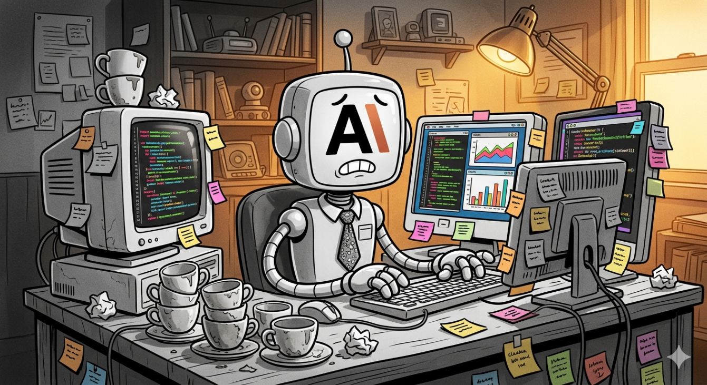
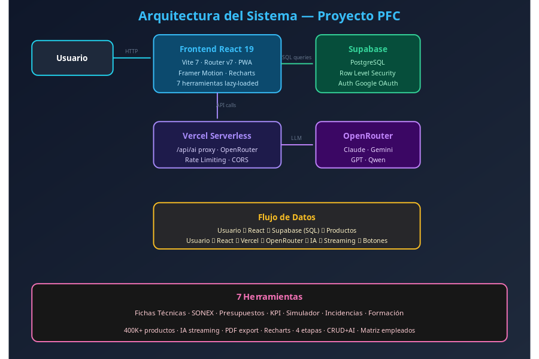
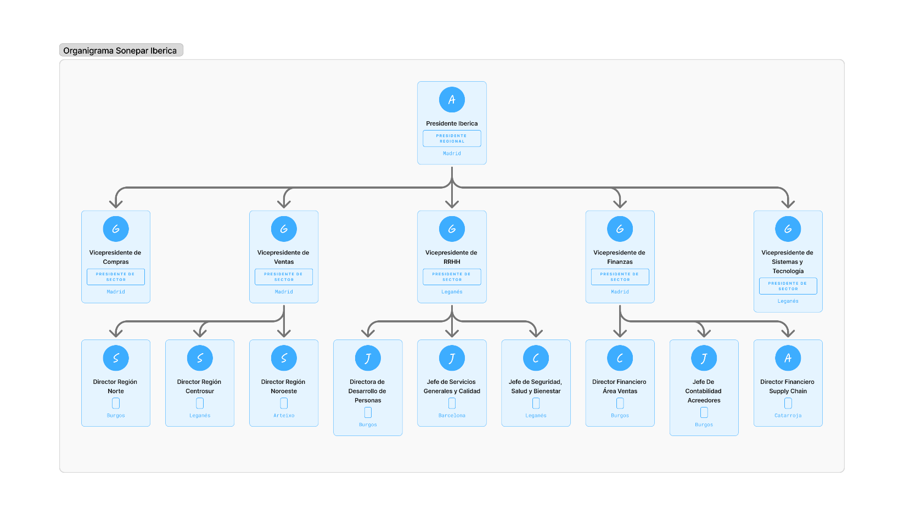
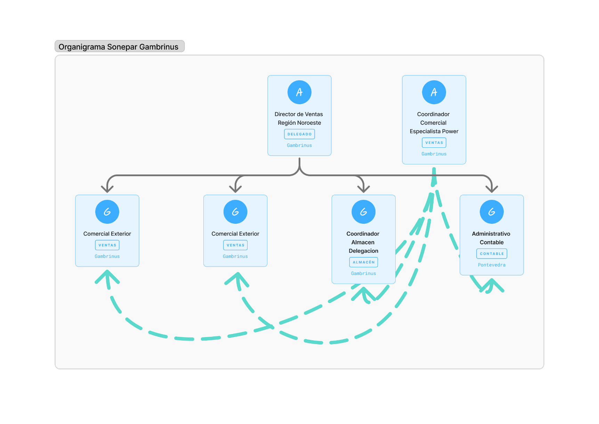

# B. ANEXOS TÉCNICOS

Este anexo recoge documentación técnica de referencia que complementa los capítulos principales de la memoria. El objetivo es proporcionar recursos reutilizables y detalles de la implementación técnica para futuros desarrollos o auditorías del proyecto.

## B.1 Arquitectura y Flujos del Sistema

La arquitectura del sistema sigue un patrón **SPA (Single Page Application)** con separación de responsabilidades entre el frontend de usuario, la lógica serverless y la base de datos backend.

### B.1.1 Diagramas de Arquitectura y Flujo

A continuación se incluyen los diagramas que describen los flujos de datos y la organización del sistema.

**Diagrama de Arquitectura Completa**

Visión general del sistema mostrando frontend (React), backend (Supabase), pasarela de IA (OpenRouter), y servicios de autenticación externos.

**Figura:** Diagrama de Arquitectura Completa



```
┌─────────────────────────────────────────────────────────────────┐
│                         USUARIO                                  │
│                    (Navegador Web)                               │
└─────────────────────────────────────────────────────────────────┘
                              │
                              ▼
┌─────────────────────────────────────────────────────────────────┐
│                      VERCEL (Hosting)                            │
│  ┌──────────────────────────────────────────────────────────┐   │
│  │  FRONTEND (React 19 + Vite 7 + TypeScript)               │   │
│  │  - Componentes UI (Tailwind CSS, Framer Motion)          │   │
│  │  - Routing (React Router v7)                             │   │
│  │  - Estado global (Context API)                           │   │
│  │  - 8 módulos: Fichas, SONEX, Presupuestos, KPIs...       │   │
│  └──────────────────────────────────────────────────────────┘   │
└─────────────────────────────────────────────────────────────────┘
                              │
                              ▼
┌─────────────────────────────────────────────────────────────────┐
│                   SERVICIOS EXTERNOS                             │
│  ┌─────────────┐  ┌─────────────┐  ┌─────────────────────────┐  │
│  │  SUPABASE   │  │ OPENROUTER  │  │    GOOGLE OAUTH         │  │
│  │  (PostgreSQL│  │  (API IA)   │  │   (Autenticación)       │  │
│  │   + Auth)   │  │             │  │                         │  │
│  │             │  │  - Claude   │  │                         │  │
│  │  - Products │  │  - Gemini   │  │                         │  │
│  │  - Users    │  │  - Llama    │  │                         │  │
│  │  - Incidencias│ │             │  │                         │  │
│  │  - KPIs     │  │             │  │                         │  │
│  └─────────────┘  └─────────────┘  └─────────────────────────┘  │
└─────────────────────────────────────────────────────────────────┘
```

**Diagrama de Flujo de Datos**

Flujo de información entre componentes: carga de catálogo, peticiones de usuario, y respuestas de IA.

**Figura:** Diagrama de Flujo de Datos



**Flujo de Usuario - Simulador de Almacén**

Diagrama de secuencia del flujo de 4 etapas del simulador logístico.

**Figura:** Flujo de Usuario - Simulador de Almacén



### B.1.2 Stack Tecnológico

El stack tecnológico está compuesto por:
- **Frontend**: React 19, Vite 7, TypeScript, Tailwind CSS y Framer Motion para animaciones fluidas.
- **Backend-as-a-Service**: Supabase, que proporciona autenticación de usuarios (con Google OAuth), base de datos relacional PostgreSQL, y políticas de seguridad RLS.
- **Pasarela de Inteligencia Artificial**: Integración con OpenRouter para acceder a modelos de lenguaje líderes (Claude 3.5 Sonnet, Gemini 1.5 Pro, Llama 3) en una única interfaz sin costes de infraestructura (tier gratuito).

## B.2 Modelo de Datos

La base de datos PostgreSQL en Supabase sigue un diseño relacional normalizado para garantizar la integridad y coherencia de los datos, protegido por **Row Level Security (RLS)**.

### B.2.1 Esquema de la Base de Datos

Esquema de la base de datos PostgreSQL en Supabase con tablas principales y relaciones.

**Figura:** Modelo de Datos - Base de Datos



## B.3 Scripts de Migración (Firebase → Supabase)

La migración del catálogo y los perfiles de usuario desde Firebase (NoSQL) a Supabase (PostgreSQL relacional) requirió scripts de transformación para mapear los documentos no estructurados a tablas estructuradas.

### B.3.1 Script de Migración de Productos

```python
# migrar_productos.py
import firebase_admin
from firebase_admin import firestore
from supabase import create_client

# Inicializar conexiones
firebase_db = firestore.client()
supabase = create_client(SUPABASE_URL, SUPABASE_KEY)

# Extraer productos de Firebase
products_ref = firebase_db.collection("products").stream()
productos_a_migrar = []

for doc in products_ref:
    data = doc.to_dict()
    productos_a_migrar.append({
        "reference": data.get("ref"),
        "name": data.get("nombre"),
        "familia": data.get("family"),
        "subfamilia": data.get("subfamily"),
        "tipo": data.get("type"),
        "marca": data.get("brand"),
        "description": data.get("desc"),
    })

# Insertar en Supabase
response = supabase.table("products").insert(productos_a_migrar).execute()
print(f"✅ Migrados {len(response.data)} productos")
```

*Lección aprendida:* Es vital validar e higienizar los datos antes de la migración. Firebase permitía campos opcionales nulos, mientras que en PostgreSQL se definieron restricciones de clave y campos no nulos, por lo que se añadieron valores por defecto durante el proceso de transformación.

## B.4 Configuración de Seguridad (RLS)

Supabase Row Level Security (RLS) protege la base de datos directamente a nivel de motor SQL. Las políticas impiden que usuarios no autorizados lean o modifiquen datos, asegurando la privacidad de la información incluso ante un compromiso en el frontend.

### B.4.1 Política de Lectura de Productos

```sql
-- Todos los usuarios autenticados pueden leer productos
CREATE POLICY "Usuarios autenticados pueden ver productos"
ON products FOR SELECT
TO authenticated
USING (auth.role() = 'authenticated');
```

### B.4.2 Política de Escritura en User Data

```sql
-- Cada usuario solo puede escribir sus propios datos
CREATE POLICY "Usuarios gestionan sus datos"
ON user_data FOR ALL
TO authenticated
USING (auth.uid() = user_id)
WITH CHECK (auth.uid() = user_id);
```
